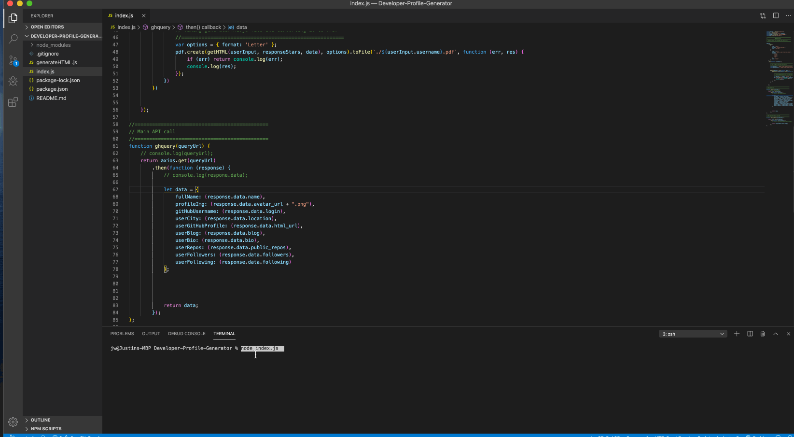

# Developer-Profile-Generator

##### A command-line application that dynamically generates a PDF profile from a GitHub username.

###### From the Termianl Install the proper packages:

```sh
npm i
```

###### Then Invoke the application with the following command:

```sh
node index.js
```

### You will be prompted for:
#### GitHub Username
#### Favorite Color
##### Use the keyboard arrows to easily select color.
#### Your file will be saved as: Username.pdf

### Demo:



### Result Example:


```
AS A product manager

I WANT a developer profile generator

SO THAT I can easily prepare reports for stakeholders
```
###### When preparing a report for stakeholders, it is important to have up-to-date information about members of the development team. Rather than navigating to each team member's GitHub profile, a command-line application will allow for quick and easy generation of profiles in PDF format.
